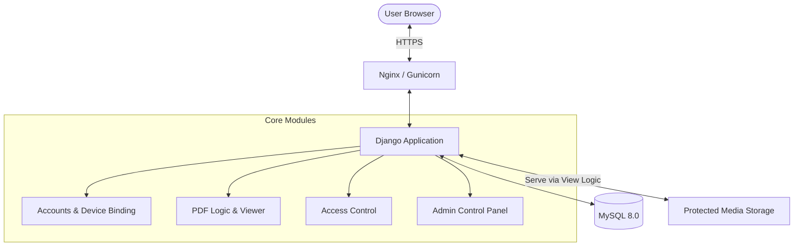
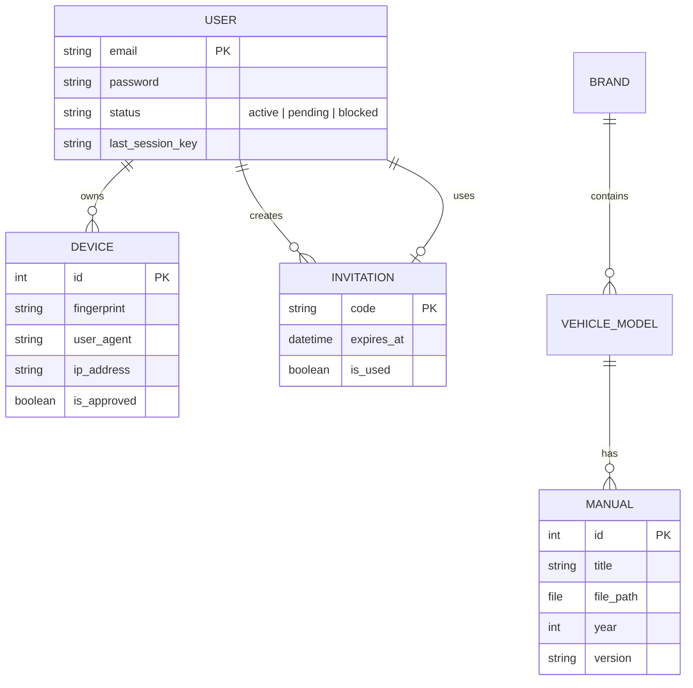

<p align="center">
  
  
  
  
  
  
</p>

<p align="center">
  <h1 align="center">🔧 Manual Reader</h1>
  <p align="center">
    <b>The Secure Repair Manual Distribution System</b><br>
    <i>Enterprise-grade document protection with dynamic watermarking, device binding, and single-session enforcement.</i>
  </p>
</p>

---

## 📖 Executive Summary

**Manual Reader** is a high-security document management platform specifically engineered for the distribution of proprietary repair manuals and technical documentation. Unlike standard PDF viewers, Manual Reader treats documents as ephemeral visual data, preventing physical file access through a "View-Only" architecture.

### Why Manual Reader?
Traditional PDF sharing is insecure. Once a file is downloaded, control is lost. **Manual Reader** solves this by:
1.  **Eliminating File Downloads:** Documents are rendered server-to-canvas.
2.  **Enforcing Accountability:** Every page is stamped with the viewer's identity.
3.  **Securing Access:** Multi-layered auth ensures only verified users on approved devices gain entry.

---

## 🗺️ System Architecture

Manual Reader follows a modular Django architecture designed for security and scalability.



---

## ✨ Key Security Features

### 🛡️ 1. View-Only PDF Viewer (Canvas-Based)
Instead of serving raw PDF files which the browser can save/print, Manual Reader utilizes **PDF.js** to render documents onto a HTML5 `<canvas>`.
- **No Direct Access:** The PDF URL is obscured and only accessible to authenticated sessions.
- **Anti-Print/Save:** System-level overrides disable `Ctrl+P`, `Ctrl+S`, and right-click menus.
- **Selection Blocking:** CSS and JS layers prevent text selection and image dragging.

### 💧 2. Dynamic Identity Watermarking
Every single page rendered in the viewer is overlaid with a dynamic watermark grid.
- **Traceability:** The overlay includes the user's **Email Address** and a **Timestamp**.
- **Visual Deterrent:** Prevents unauthorized photography/screenshots by ensuring the leaker's identity is visible.

### 🔐 3. Single-Session Enforcement (SSE)
A custom middleware monitors active sessions. If a user logs in from a new location/browser, the previous session is immediately invalidated.
- **No Account Sharing:** Prevents multiple people from using a single set of credentials simultaneously.

### 📱 4. Device Fingerprinting & Binding
Security doesn't stop at passwords. Every device is fingerprinted upon first login.
- **Admin Approval:** New devices are placed in a "Pending" state and require manual administrator approval.
- **Hardware Binding:** Access is restricted to specific hardware profiles.

---

## 🛠️ Technology Stack

### Backend Infrastructure
- **Python 3.11:** Core programming language.
- **Django 5.x:** Robust web framework with built-in security.
- **MySQL 8.0:** Relational database for structured data.
- **Django Environ:** Secure environment variable management.

### Frontend Engineering
- **Tailwind CSS:** Utility-first CSS for a modern, responsive UI.
- **Alpine.js:** Lightweight JavaScript for client-side state management.
- **PDF.js:** Mozilla's open-source PDF parsing and rendering library.
- **Glassmorphism UI:** Sophisticated design system using multi-layered blur, refined gradients, and Plus Jakarta Sans typography.
- **Cinematic Animations:** Staggered load effects, Shopify-style cycling text, and smooth micro-interactions.

### Deployment & DevOps
- **Docker:** Containerization for environment consistency.
- **Docker Compose:** Multi-container orchestration.
- **Gunicorn:** Production-grade WSGI HTTP Server.

---

## 📂 Database Schema



---

## 🚀 Installation & Setup

### 🐳 Docker Deployment (Recommended)

1.  **Clone & Enter:**
    ```bash
    git clone https://github.com/yourusername/manual-reader.git
    cd manual-reader
    ```

2.  **Environment Setup:**
    ```bash
    # Create environment file
    cp .env.example .env
    # Edit .env with your specific secrets
    ```

3.  **Launch Infrastructure:**
    ```bash
    docker-compose up --build -d
    ```

4.  **Database Initialisation:**
    ```bash
    docker-compose exec web python manage.py makemigrations
    docker-compose exec web python manage.py migrate
    ```

5.  **Administrative Access:**
    ```bash
    docker-compose exec web python manage.py createsuperuser
    ```

### 🐍 Local Development Setup

If you prefer to run without Docker:

```bash
# 1. Environment
python -m venv venv
source venv/bin/activate

# 2. Dependencies
pip install -r requirements.txt

# 3. Database (Requires local MySQL)
# Create database 'manual_reader' in MySQL
python manage.py migrate

# 4. Start Server
python manage.py runserver
```

---

## 📁 Project Structure

```bash
manual-reader/
├── apps/
│   ├── accounts/          # Core security: User models, Device binding, SSE Middleware
│   ├── manuals/           # Domain logic: PDF storage, Brand/Model hierarchy, Viewer
│   ├── invitations/       # Access Control: Single-use registration codes
│   └── dashboard/         # Admin UI: User approval, Code generation, Stats
├── config/                # Project configuration (settings, urls, wsgi)
├── templates/             # HTML templates (Tailwind + Alpine.js)
├── static/                # CSS, JS, and image assets
├── media/                 # SECURE STORAGE for PDF documents
├── Dockerfile             # Web service definition
└── docker-compose.yml     # Full stack orchestration
```

---

## 🚦 Application Flows

### Registration & Onboarding
1.  **Invitation:** Admin generates a secure code in the Dashboard.
2.  **Signup:** User provides the code, email, and password.
3.  **Review:** Admin receives notification of a "Pending" user.
4.  **Approval:** Admin verifies identity and activates the account.

### Document Access
1.  **Auth:** User logs in (SSE checks if they are logged in elsewhere).
2.  **Binding:** System checks if the device is approved.
3.  **Navigation:** User selects Brand → Model → Year.
4.  **Security Render:** PDF.js fetches chunks, renders to canvas, and overlays watermarks.

---

## 🔒 Security Hardening (Production)

To ensure maximum security in production environments, ensure the following Django settings are enabled:

- `SECURE_BROWSER_XSS_FILTER = True`
- `SECURE_CONTENT_TYPE_NOSNIFF = True`
- `SESSION_COOKIE_SECURE = True`
- `CSRF_COOKIE_SECURE = True`
- `X_FRAME_OPTIONS = 'DENY'` (Prevents clickjacking)

---

## 🛠️ Troubleshooting

| Issue | Potential Cause | Solution |
|-------|-----------------|----------|
| **PDF not loading** | Media permissions / worker error | Check `media/` folder permissions and console logs for PDF.js worker path. |
| **MySQL Connection Refused** | Container startup timing | Use `docker-compose ps` to ensure DB is healthy. Restart web container if needed. |
| **Watermarks missing** | CSS Z-index conflict | Ensure `.watermark-overlay` has higher Z-index than the canvas. |

---

## 📜 License

Distributed under the MIT License. See `LICENSE` for more information.

---

<p align="center">
  <b>Manual Reader</b> • Secure Document Delivery
</p>
